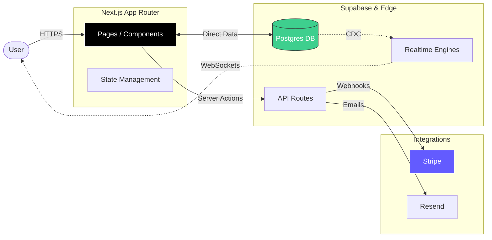

# TrakSlip | Construction Time & Material Tracking Software

**Eliminate paper T&M tickets. The digital standard for General Contractors and Subcontractors to track time, materials, and approvals.**
www.trakslip.com

---

## 🚀 The Why
**Problem**: Verification of Extra Work, Time & Materials (T&M) is chaos. Construction projects lose thousands in revenue due to lost, illegible, disputed paper tickets or fraud. Admin teams waste hours manually typing extensive handwritten logs into invoices and tracking uncompleted work.

**Solution**: TrakSlip digitizes the entire workflow. 
1. **Field Verification**: Subcontractors log hours and materials instantly on mobile.
2. **Real-Time Approval**: General Contractors review and sign digitally on the spot.
3. **Instant Invoicing**: Validated PDF reports are generated instantly, speeding up payment cycles by 40%.

---

## 🛠️ Tech Stack

### Frontend
- **Framework**:  (App Router)
- **Language**: 
- **Styling**: 
- **State**: React Context (Auth, Toast, PostHog)
- **Analytics**: 

### Backend (Serverless)
- **Platform**:  (Edge Network)
- **Database**:  (PostgreSQL)
- **Auth**: Supabase Auth
- **Realtime**: Supabase Realtime (WebSockets)

### Integrations
- **Payments**: 
- **Email**: 

---

## 🏗️ Architecture

TrakSlip leverages an Event-Driven, Edge-First architecture to ensure speed on job sites and strict data isolation between competing contractors.

### Key Architectural Highlights
*   **Row Level Security (RLS)**: We don't just filter data in the API. Security policies are enforced directly in the database engine, ensuring a Subcontractor can *never* access another company's data, even if the API layer fails.
*   **Real-Time Sync**: When a ticket status changes from "Pending" to "Approved", the UI updates instantly for all connected users without a page reload, powered by Postgres CDC and WebSockets.
*   **Edge Functions**: Critical logic runs on Vercel's Edge Network, reducing latency for mobile users on cellular data.

---

## ✨ Key Features

### 🏗️ Digital T&M Workflow
*   **Instant Digital Tickets**: Mobile-friendly forms optimized for entry in the field.
*   **Digital Signatures**: Capture authentic signatures from GCs on-site (touchscreen).
*   **Photo Evidence**: Mandatory photo upload steps to reduce disputes (e.g., "Show me the damaged conduit").
*   **Contextual Messaging**: Dedicated chat threads on every ticket allow GCs and Subs to resolve questions instantly without chasing emails.

### 🏢 Organization & Management
*   **Role-Based Portals**:
    *   **General Contractor**: Dashboard for approvals, disputes, and project oversight.
    *   **Subcontractor**: Field-focused interface for quick entry and status tracking.
*   **Inventory Control**: Define standard materials and personnel rates (e.g., "Journeyman - $85/hr") to prevent billing errors.

### 🚀 Productivity
*   **One-Click Invoicing**: Generate professional, branded PDF reports ready for billing with `jsPDF`.
*   **Anti-Fraud Ledger**: A permanent, non-editable audit log of every action (Created, Edited, Viewed, Approved). Actions cannot be hidden or deleted without a trace.

---

## 📸 Visuals

| Landing Page | Ticket Entry (Mobile) |
|:---:|:---:|
|  |  |

| GC Dashboard | SC Dashboard |
|:---:|:---:|
|  |  |

---

## 📄 License
This project is proprietary and confidential. Unauthorized copying of this file, via any medium is strictly prohibited.

## ⚠️ Note on Deployment

**This repository contains the source code for TrakSlip. The code is not currently published or deployed from this public repository due to security considerations and ongoing development.**

We are sharing this README to showcase the architecture and technologies used in building this application.
